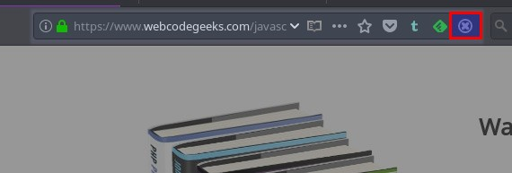

[//]: # (Filename: README.md)
[//]: # (Author: Iván Ruvalcaba)
[//]: # (Contact: <mario.i.ruvalcaba[at]gmail[dot]com>)
[//]: # (Created: 26 dic 2016 16:50:04)
[//]: # (Last Modified: 03 sep 2017 18:52:30)

# Behind The Overlay Revival —Mozilla Firefox WebExtension—

> This project is a fork of [Behind The Overlay](https://github.com/NicolaeNMV/BehindTheOverlay) add-on, ported as _Mozilla Firefox WebExtension_ as well as some improvements implemented.

## What's it all about?

Some websites will use an overlay to mask its content with a transparent background to force you to read a message before you can see the actual content.

I find this very annoying as every site will have a different way to close that overlay popup.

This extension solves this problem by offering you **one button to close any overlay on any website** you may ever encounter.

## WebExtension in action

## Does it work everywhere ?

The extension should work on all sites that have overlays.

## Features

+ Requires no special permissions.
+ Extremely lightweight, relies on little known `document.elementFromPoint` browser's function to find elements that are in front with the highest z-index.
+ Non-intrusive. The extension activates only when you click its button (**and now with context menu and shortcut support!!!**), thereby it has no impact on navigation performance when you don't use the extension. Doesn't inject tons of CSS rules as AdBlock extension is doing for example.
+ Supports hiding of multiple DOM overlay elements.
+ Enables overflow auto of the body when overlay script hides it to disable the scroll of the page.

## Changelog

+ Porting the original complement as _Firefox Web Extension_.
+ Improved the original code.
+ Add to _Behind The Overlay Revival_ one shortcut (`Alt + Shift + x`).
+ English/Spanish translations added (locale support).
+ Implemented a clickable icon inside the browser's address bar (`pageAction`).

## Feedback

If you have any suggestion or comment, please create an issue here. Any feedback is highly appreciated.

## License

Licensed under the [MIT License](http://www.opensource.org/licenses/mit-license.php).

